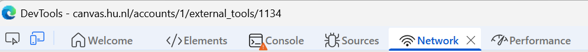
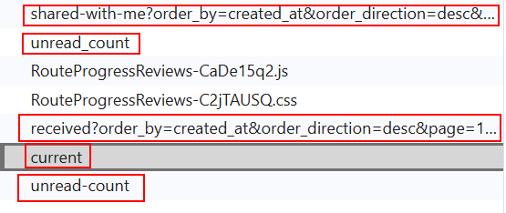
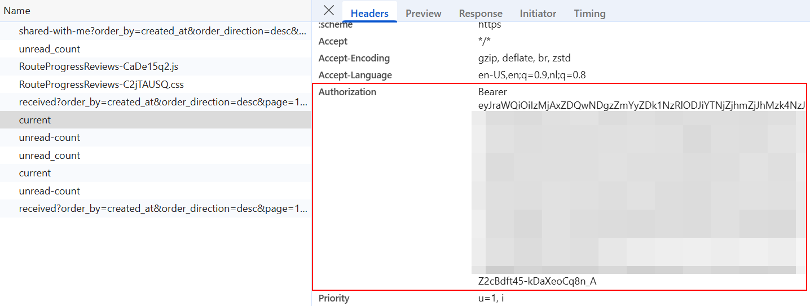

# README – Portflow Evaluatie Export Script

Dit Python-script haalt evaluaties en feedback op van studenten uit Portflow en kan deze exporteren naar een CSV-bestand of op het scherm tonen voor één student.  

---

## Bearer-token ophalen

1. [Open Portflow](https://canvas.hu.nl/accounts/1/external_tools/1134) via Canvas in de browser.  
2. Rechtsklik op de pagina en kies **Inspect**.  

3. Ga naar het tabblad **Network** (Netwerk).  

4. Navigeer naar een andere pagina in Portflow, bijvoorbeeld **Evaluatieverzoeken**.  
5. Zoek in de lijst met requests een request met woorden zoals `dashboard`, `sections`, `current`, `received`, etc. (geen .css, .js, etc bestanden)

6. Klik op dit request en scroll naar **Request Headers**.  
7. Zoek de regel **Authorization** en kopieer alles wat achter `Bearer ` staat (begint meestal met `eyJ...`).  
   - Dit is je Bearer-token dat het script nodig heeft om verbinding te maken met Portflow. 

 

8. Gebruik deze Bearer token in het script.

---

## Script starten (EXE)
1. Open de gedownloade .exe file.
2. Done.

## Script starten (Python)

## Menu Uitleg
### Studenten ophalen

Je kunt kiezen tussen:

1) Alle studenten met gedeelde collectie

2) Studenten uit een voorgedefineerde sectie. **LET OP**: Om privacy redenen is deze file niet op GitHub beschikbaar. Vraag deze aan bij Noah Taheij.
 
3) Studenten uit een custom sectie (je vult dan section_id in, terug te vinden in de requests van Portflow op het coachingdashboard)

### Output kiezen

1) Enkel een student → laat alle evaluaties voor die student zien.

2) Alle studenten → export naar CSV → maakt een CSV-bestand results.csv met evaluaties per student en per doel.

### CSV-formaat
Header: Studentname, Goal1, Goal2, Goal3...

Voor elk doel staan de evaluaties zoals:

Startniveau, 1, 1
Meerdere evaluaties worden gescheiden door een komma.

## Extra info
Ctrl+C: het script kan altijd netjes afgesloten worden met Ctrl+C.

Bearer-token verlopen: als je token is verlopen, zal het script vragen om een nieuw token.

Fouten bij netwerk: het script probeert automatisch tot 3 keer opnieuw bij netwerkproblemen. Na 3 mislukte pogingen wacht het 1 minuut en gaat verder.

## Tips
Zorg dat je Bearer-token geldig is bij aanvang.

Gebruik de terminal / command prompt in dezelfde map als het script om problemen met bestandslocaties te voorkomen.

Als er veel studenten zijn, kan het verwerken even duren.